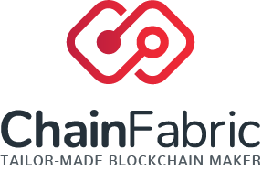

# Programming Blockchain Applications: Chapter 4

This folder contains the source codes as described in chapter 4 of the "Programming Blockchain Applications" book:
* MyERC20Token - An example of an ERC-20 token.

# Compatibility

All smart contracts are compatible with Solidity >=0.4.25 and <0.6.0.

# Usage

Please refer to chapter 4 of the book.

# Security

ALL SOURCE CODES SHOULD BE USED AS LEARNING MATERIAL ONLY.

## License

All source codes included in this repository are released under the [MIT License](LICENSE).
