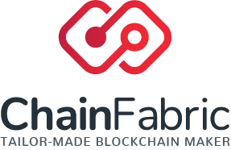

# Programming Blockchain Applications

This repository contains the source codes listed as examples in the book "Programming Blockchain Applications".

## Installation & Usage

Each folder includes a README.md file with all instruction for the installation and the usage.

## Security

ALL SOURCE CODES MUST BE USED AS LEARNING MATERIAL ONLY.

## License

All source codes included in this repository are released under the [MIT License](LICENSE).
